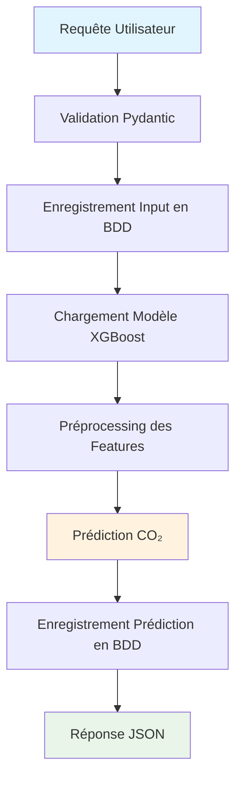
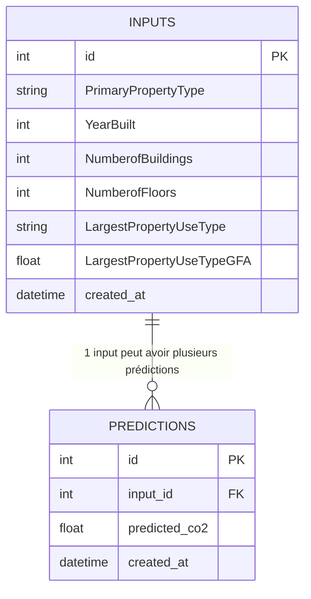
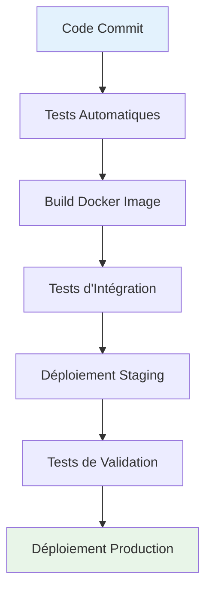

# Documentation des Processus de Données

## Vue d'ensemble

Ce document décrit les flux de données, les processus métier et les transformations appliquées dans l'API de prédiction des émissions CO₂.

## Flux de Données Principal

### 1. Processus de Prédiction



### 2. Pipeline de Données Détaillé

#### Étape 1 : Réception et Validation
- **Input** : JSON avec 6 features obligatoires
- **Validation** : Pydantic avec contraintes métier
- **Output** : Objet Python validé

```python
# Exemple de validation
{
    "PrimaryPropertyType": "Office",           # String non vide
    "YearBuilt": 2000,                        # 1800 <= année <= année_courante
    "NumberofBuildings": 1,                   # >= 1
    "NumberofFloors": 5,                      # >= 0
    "LargestPropertyUseType": "Office",       # String non vide
    "LargestPropertyUseTypeGFA": 50000.0      # >= 1
}
```

#### Étape 2 : Persistance des Données d'Entrée
- **Table** : `inputs`
- **Objectif** : Traçabilité et audit
- **Champs** : Toutes les features + timestamp

#### Étape 3 : Chargement du Modèle
- **Fichier** : `models/model_emissions_co2.joblib`
- **Métadonnées** : `models/model_metadata.joblib`
- **Contenu** : Pipeline XGBoost complet

#### Étape 4 : Préprocessing
- **Imputation** : Valeurs manquantes (median)
- **Scaling** : RobustScaler pour les features numériques
- **Encoding** : LabelEncoder pour les features catégorielles

#### Étape 5 : Prédiction
- **Modèle** : XGBoost Regressor
- **Output** : Valeur continue (Metric Tons CO2e)
- **Performance** : RMSE ~402, R² ~0.78...

#### Étape 6 : Persistance de la Prédiction
- **Table** : `predictions`
- **Relation** : Foreign Key vers `inputs.id`
- **Champs** : Valeur prédite + timestamp

## Architecture des Données

### Modèle de Données



### Types de Données

| Feature | Type | Contraintes | Description |
|---------|------|-------------|-------------|
| `PrimaryPropertyType` | String | Non vide | Type de propriété principal |
| `YearBuilt` | Integer | 1800 ≤ année ≤ année courante | Année de construction |
| `NumberofBuildings` | Integer | ≥ 1 | Nombre de bâtiments |
| `NumberofFloors` | Integer | ≥ 0 | Nombre d'étages |
| `LargestPropertyUseType` | String | Non vide | Type d'usage principal |
| `LargestPropertyUseTypeGFA` | Float | ≥ 1 | Surface utile (sqft) |

## Processus d'Entraînement

### Pipeline ML Complet


### Étapes d'Entraînement

1. **Chargement des données**
   - Source : `src/ville_de_seattle.csv`
   - Format : CSV avec ~3000 bâtiments (~1500 non Résidentiel)
   - Target : `TotalGHGEmissions`

2. **Split des données**
   - Train : 80% (stratifié sur `PrimaryPropertyType`)
   - Test : 20%
   - Random state : 0 (reproductibilité)

3. **Préprocessing**
   ```python
   # Pipeline de préprocessing
   num_pipeline = make_pipeline(
       SimpleImputer(strategy='median'),
       RobustScaler()
   )
   
   cat_pipeline = make_pipeline(
       FunctionTransformer(label_encode_columns)
   )
   ```

4. **Modèle XGBoost**
   ```python
   XGBRegressor(
       random_state=0,
       n_estimators=65,
       learning_rate=0.18,
       max_depth=2,
       subsample=0.85,
       gamma=0.3
   )
   ```

5. **Métriques de Performance**
   - RMSE : 402.4
   - MAE : 113.9
   - WAPE : 0.58
   - R² : 0.78

## Processus de Monitoring

### Métriques de Performance

| Métrique | Valeur | Interprétation |
|----------|--------|----------------|
| **RMSE** | 402.4rreur quadratique moyenne |
| **MAE** | 113.9 | Erreur absolue moyenne |
| **WAPE** | 0.58 | Erreur relative pondérée (58%) |
| **R²** | 0.78 | 78% de variance expliquée |

### Surveillance en Temps Réel

1. **Health Check** (`/health`)
   - Vérification du chargement du modèle
   - État de la base de données
   - Disponibilité des services

2. **Métriques d'Usage**
   - Nombre de prédictions par jour
   - Temps de réponse moyen
   - Taux d'erreur

3. **Qualité des Données**
   - Validation des inputs
   - Détection d'anomalies
   - Drift des données

## Processus de Debugging

### Traçabilité

1. **Traçabilité Complète**
   - Chaque prédiction est liée à son input
   - Timestamps pour audit
   - Historique des 100 dernières prédictions

2. **Debugging des Erreurs**
   - Validation des inputs
   - Gestion des exceptions
   - Messages d'erreur explicites

## Processus de Déploiement

### Pipeline CI/CD



### Étapes de Déploiement

1. **Tests Automatiques**
   - Tests unitaires (pytest)
   - Tests d'intégration
   - Validation du modèle

2. **Build Docker**
   - Image optimisée
   - Variables d'environnement
   - Health checks

3. **Déploiement**
   - Migration de base de données
   - Démarrage des services
   - Vérification de santé

## Processus de Données Analytiques

### Besoins Analytiques

1. **Analyse des Prédictions**
   - Distribution des émissions CO₂
   - Corrélations entre features
   - Tendances temporelles

2. **Performance du Modèle**
   - Évolution des métriques
   - Détection de drift
   - A/B testing

3. **Usage de l'API**
   - Volume de requêtes
   - Patterns d'utilisation
   - Géolocalisation des utilisateurs

## Processus de Maintenance

### Maintenance Préventive

1. **Nettoyage des Données**
   - Suppression des anciennes prédictions
   - Archivage des logs
   - Optimisation de la base

2. **Mise à Jour du Modèle**
   - Réentraînement périodique
   - Validation des performances
   - Déploiement en douceur

3. **Monitoring Proactif**
   - Alertes de performance
   - Surveillance des ressources
   - Backup automatique

### Maintenance Corrective

1. **Gestion des Incidents**
   - Procédures d'urgence
   - Rollback automatique
   - Communication utilisateurs

2. **Résolution des Bugs**
   - Debugging systématique
   - Tests de régression
   - Documentation des corrections

---

*Cette documentation est maintenue à jour avec chaque évolution du système.*
