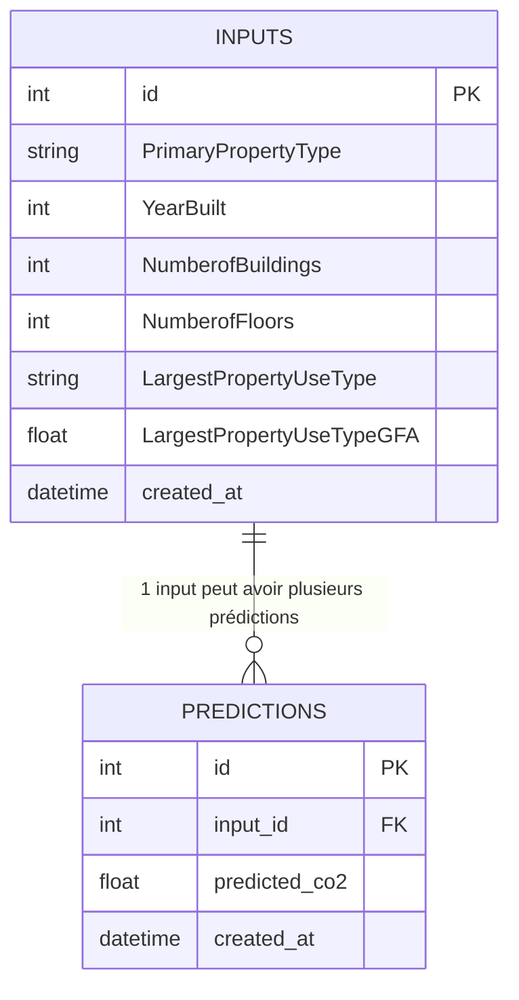

# Schéma de Base de Données - API Prédiction CO₂

## Diagramme UML



## Description des Tables

### Table `inputs`
Stocke les données d'entrée envoyées au modèle de prédiction.

| Colonne | Type | Contrainte | Description |
|---------|------|------------|-------------|
| `id` | INTEGER | PRIMARY KEY, AUTO_INCREMENT | Identifiant unique de l'entrée |
| `PrimaryPropertyType` | VARCHAR | NOT NULL | Type de propriété principal (ex: Office, Retail, etc.) |
| `YearBuilt` | INTEGER | NOT NULL | Année de construction du bâtiment |
| `NumberofBuildings` | INTEGER | NOT NULL | Nombre de bâtiments sur le site |
| `NumberofFloors` | INTEGER | NOT NULL | Nombre d'étages du bâtiment |
| `LargestPropertyUseType` | VARCHAR | NOT NULL | Type d'usage principal du bâtiment |
| `LargestPropertyUseTypeGFA` | FLOAT | NOT NULL | Surface utile du type d'usage majeur (en sqft) |
| `created_at` | TIMESTAMP | DEFAULT CURRENT_TIMESTAMP | Date et heure de création de l'entrée |

### Table `predictions`
Stocke les prédictions générées par le modèle.

| Colonne | Type | Contrainte | Description |
|---------|------|------------|-------------|
| `id` | INTEGER | PRIMARY KEY, AUTO_INCREMENT | Identifiant unique de la prédiction |
| `input_id` | INTEGER | FOREIGN KEY | Référence vers l'entrée correspondante |
| `predicted_co2` | FLOAT | NOT NULL | Valeur prédite d'émissions CO₂ (Metric Tons CO2e) |
| `created_at` | TIMESTAMP | DEFAULT CURRENT_TIMESTAMP | Date et heure de création de la prédiction |

## Relations

- **Relation 1:N** : Une entrée (`inputs`) peut avoir plusieurs prédictions (`predictions`)
- **Clé étrangère** : `predictions.input_id` → `inputs.id`

## Script SQL de Création

```sql
-- Table inputs
CREATE TABLE inputs (
    id SERIAL PRIMARY KEY,
    "PrimaryPropertyType" VARCHAR(255) NOT NULL,
    "YearBuilt" INTEGER NOT NULL,
    "NumberofBuildings" INTEGER NOT NULL,
    "NumberofFloors" INTEGER NOT NULL,
    "LargestPropertyUseType" VARCHAR(255) NOT NULL,
    "LargestPropertyUseTypeGFA" FLOAT NOT NULL,
    created_at TIMESTAMP WITH TIME ZONE DEFAULT CURRENT_TIMESTAMP
);

-- Table predictions
CREATE TABLE predictions (
    id SERIAL PRIMARY KEY,
    input_id INTEGER NOT NULL,
    predicted_co2 FLOAT NOT NULL,
    created_at TIMESTAMP WITH TIME ZONE DEFAULT CURRENT_TIMESTAMP,
    FOREIGN KEY (input_id) REFERENCES inputs(id)
);

-- Index pour améliorer les performances
CREATE INDEX idx_inputs_created_at ON inputs(created_at);
CREATE INDEX idx_predictions_input_id ON predictions(input_id);
CREATE INDEX idx_predictions_created_at ON predictions(created_at);
```

## Exemples de Données

### Exemple d'entrée
```json
{
  "id": 1,
  "PrimaryPropertyType": "Office",
  "YearBuilt": 2000,
  "NumberofBuildings": 1,
  "NumberofFloors": 5,
  "LargestPropertyUseType": "Office",
  "LargestPropertyUseTypeGFA": 50000.0,
  "created_at": "2024-01-15T10:30:00Z"
}
```

### Exemple de prédiction
```json
{
  "id": 1,
  "input_id": 1,
  "predicted_co2": 186.65,
  "created_at": "2024-01-15T10:30:05Z"
}
```

## Utilisation dans l'API

### Flux de données
1. L'utilisateur envoie une requête POST à `/predict`
2. Les données d'entrée sont validées par Pydantic
3. Les données sont enregistrées dans la table `inputs`
4. Le modèle génère une prédiction
5. La prédiction est enregistrée dans la table `predictions`
6. La réponse est renvoyée à l'utilisateur

### Fonctions principales
- `save_input(data)` : Enregistre les données d'entrée
- `save_prediction(input_id, co2_value)` : Enregistre la prédiction
- `get_inputs_json()` : Récupère toutes les entrées
- `get_predictions_json()` : Récupère toutes les prédictions
